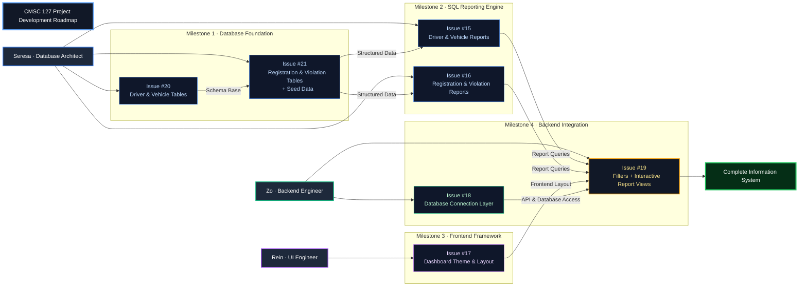

```mermaid
flowchart LR

%% =====================================================
%% PROJECT TITLE
%% =====================================================

TITLE["CMSC 127 Project Development Roadmap"]

%% =====================================================
%% MILESTONE 1
%% =====================================================

subgraph M1["Milestone 1 · Database Foundation"]

    DB1["Issue #20
    Driver & Vehicle Tables"]

    DB2["Issue #21
    Registration & Violation Tables
    + Seed Data"]

end

%% =====================================================
%% MILESTONE 2
%% =====================================================

subgraph M2["Milestone 2 · SQL Reporting Engine"]

    SQL1["Issue #15
    Driver & Vehicle Reports"]

    SQL2["Issue #16
    Registration & Violation Reports"]

end

%% =====================================================
%% MILESTONE 3
%% =====================================================

subgraph M3["Milestone 3 · Frontend Framework"]

    UI1["Issue #17
    Dashboard Theme & Layout"]

end

%% =====================================================
%% MILESTONE 4
%% =====================================================

subgraph M4["Milestone 4 · Backend Integration"]

    BE1["Issue #18
    Database Connection Layer"]

    FULL1["Issue #19
    Filters + Interactive Report Views"]

end

%% =====================================================
%% OWNERSHIP
%% =====================================================

DB_OWNER["Seresa · Database Architect"]
UI_OWNER["Rein · UI Engineer"]
BE_OWNER["Zo · Backend Engineer"]

DB_OWNER --> DB1
DB_OWNER --> DB2
DB_OWNER --> SQL1
DB_OWNER --> SQL2

UI_OWNER --> UI1

BE_OWNER --> BE1
BE_OWNER --> FULL1

%% =====================================================
%% DEPENDENCY FLOW
%% =====================================================

DB1 -->|"Schema Base"| DB2

DB2 -->|"Structured Data"| SQL1
DB2 -->|"Structured Data"| SQL2

SQL1 -->|"Report Queries"| FULL1
SQL2 -->|"Report Queries"| FULL1

UI1 -->|"Frontend Layout"| FULL1
BE1 -->|"API & Database Access"| FULL1

%% =====================================================
%% FINAL OUTPUT
%% =====================================================

FINAL["Complete Information System"]

FULL1 --> FINAL

%% =====================================================
%% STYLING
%% =====================================================

style TITLE fill:#111827,stroke:#60a5fa,stroke-width:3px,color:#ffffff
style FINAL fill:#052e16,stroke:#22c55e,stroke-width:3px,color:#ffffff

style DB_OWNER fill:#1e293b,stroke:#3b82f6,stroke-width:2px,color:#ffffff
style UI_OWNER fill:#1e293b,stroke:#a855f7,stroke-width:2px,color:#ffffff
style BE_OWNER fill:#1e293b,stroke:#10b981,stroke-width:2px,color:#ffffff

classDef database fill:#0f172a,stroke:#3b82f6,color:#bfdbfe
classDef frontend fill:#0f172a,stroke:#a855f7,color:#e9d5ff
classDef backend fill:#0f172a,stroke:#10b981,color:#bbf7d0
classDef integration fill:#111827,stroke:#f59e0b,stroke-width:2px,color:#fde68a

class DB1,DB2,SQL1,SQL2 database
class UI1 frontend
class BE1 backend
class FULL1 integration
```
