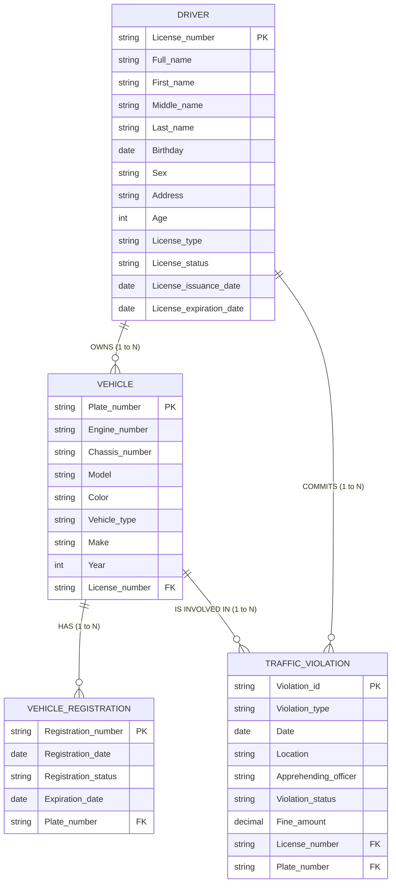

# MAYLA — Entity Relationship Diagram

```mermaid
erDiagram

    DRIVER {
        string License_number PK
        string Full_name
        string First_name
        string Middle_name
        string Last_name
        date   Birthday
        string Sex
        string Address
        int    Age
        string License_type
        string License_status
        date   License_issuance_date
        date   License_expiration_date
    }

    VEHICLE {
        string Plate_number    PK
        string Engine_number
        string Chassis_number
        string Model
        string Color
        string Vehicle_type
        string Make
        int    Year
        string License_number  FK
    }

    VEHICLE_REGISTRATION {
        string Registration_number PK
        date   Registration_date
        string Registration_status
        date   Expiration_date
        string Plate_number        FK
    }

    TRAFFIC_VIOLATION {
        string Violation_id        PK
        string Violation_type
        date   Date
        string Location
        string Apprehending_officer
        string Violation_status
        decimal Fine_amount
        string License_number      FK
        string Plate_number        FK
    }

    DRIVER         ||--o{ VEHICLE             : "OWNS (1 to N)"
    VEHICLE        ||--o{ VEHICLE_REGISTRATION : "HAS (1 to N)"
    DRIVER         ||--o{ TRAFFIC_VIOLATION    : "COMMITS (1 to N)"
    VEHICLE        ||--o{ TRAFFIC_VIOLATION    : "IS INVOLVED IN (1 to N)"
```
